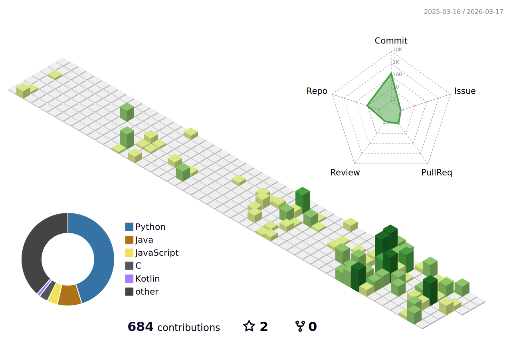

  

**"코드로 세상을 더 나은 곳으로 만드는 개발자"**

Dankook Univ. Mobile Systems Engineering 2024 (GPA 4.16/4.5)
정보처리기능사 (2025.09)

Republic of Korea Navy, Class 723 (2026.03~)

---

### Achievements

| 2025 단국대 제로톤 | 2025 U300+ 성장트랙 A |
|:---:|:---:|
| **최우수상** | **최종선발** |
| 신바람팀 - Blitz Q | Quantrum AI |

---

### GitHub Stats

---

### Tech Stack

**Languages**

**Frameworks & Tools**

---

### Contribution Garden

<picture>
  <source media="(prefers-color-scheme: dark)" srcset="./profile-3d-contrib/profile-night-rainbow.svg"/>
  <source media="(prefers-color-scheme: light)" srcset="./profile-3d-contrib/profile-green-animate.svg"/>
  
</picture>

---

  

