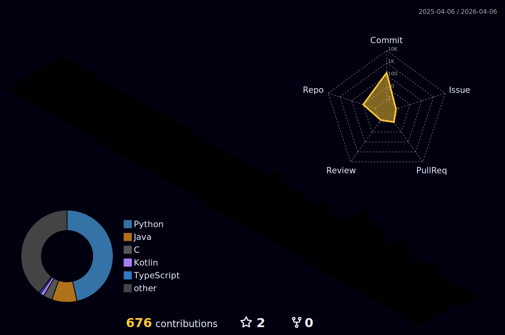

  

  
  **"코드로 세상을 더 나은 곳으로 만드는 개발자"**
  
  📚 Dankook Univ. Mobile Systems Engineering 2024 (GPA 4.16/4.5)  
  📜 정보처리기능사 (2025.09)　⚓ 해군 723기 (2026.03~)

  
  
  

---

### 🏆 Achievements
| 🥇 2025 단국대 제로톤 | 🚀 2025 U300+ 성장트랙 A |
|:---:|:---:|
| **최우수상** (신바람팀 - Blitz Q) | **최종선발** (Quantrum AI) |

---

### 🌾 Contribution Garden

  

---

### 🐍 Snake Animation

  <picture>
    <source media="(prefers-color-scheme: dark)" srcset="https://raw.githubusercontent.com/codeminjun/codeminjun/output/github-snake-dark.svg">
    <source media="(prefers-color-scheme: light)" srcset="https://raw.githubusercontent.com/codeminjun/codeminjun/output/github-snake.svg">
    
  </picture>

---

### 🛠 Tech Stack

  
  **Languages**  
  
  
  
  
  
  **Frameworks & Tools**  
  
  
  
  
  

---

  

